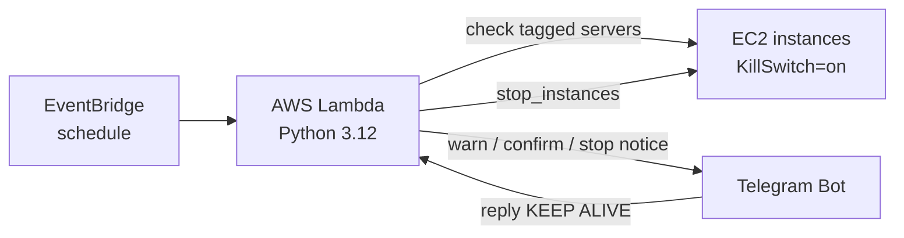

# Telegram Kill Switch for AWS EC2

A "default-to-off" FinOps tool. It warns you on Telegram when an EC2 server has been running too long, and **stops it automatically** unless you reply `KEEP ALIVE`.

> Built by **[Your Name]**, [Your College], [Year]. Demo video: **[add video link]**

## The problem

Cloud servers bill for every minute they run. Forgetting one (after a hackathon, an exam project or a pipeline test) can quietly cost $200 to $500 a month. AWS billing alarms only fire **after** the money is spent, and they send emails that get buried.

## The solution

Instead of passively warning, this project takes action:

1. **High-visibility alert:** a Telegram message to your phone.
2. **Default to shutdown:** if you don't respond within the grace period, the server is stopped.
3. **Zero-friction override:** reply `KEEP ALIVE` and the timer resets. No AWS console login needed.

## Architecture



## How it works

Every run, the Lambda function:

1. Finds running EC2 instances tagged `KillSwitch = on` (opt-in, so nothing else is touched).
2. Polls Telegram for a `KEEP ALIVE` message from **your chat ID only**.
3. If `KEEP ALIVE` was received, it resets the timer (tag `ks-start`) and clears any pending warning.
4. If uptime exceeds `LIMIT_MINUTES`, it sends a warning and records the time (tag `ks-warned`).
5. If a warning is older than `GRACE_MINUTES` with no reply, it stops the instance.

State is stored in EC2 tags, so no database is needed.

## Tech stack

AWS Lambda, Amazon EventBridge, Amazon EC2, AWS IAM, CloudWatch Logs, Python 3.12 (`boto3`, standard library only), Telegram Bot API.

## Setup

1. **Telegram:** create a bot with `@BotFather`, save the token, and find your chat ID via `https://api.telegram.org/bot<TOKEN>/getUpdates`.
2. **EC2:** launch a server and add the tag `KillSwitch = on`.
3. **IAM:** create a Lambda role with `AWSLambdaBasicExecutionRole` plus this inline policy:

```json
{
  "Version": "2012-10-17",
  "Statement": [{
    "Effect": "Allow",
    "Action": [
      "ec2:DescribeInstances",
      "ec2:StopInstances",
      "ec2:CreateTags",
      "ec2:DeleteTags"
    ],
    "Resource": "*"
  }]
}
```

4. **Lambda:** create a Python 3.12 function, paste [`lambda_function.py`](lambda_function.py), click **Deploy**, and set the timeout to 30 seconds.
5. **Environment variables:**

| Variable | Description | Production value |
|---|---|---|
| `TOKEN` | Telegram bot token (**never commit this**) | n/a |
| `CHAT_ID` | Your Telegram chat ID | n/a |
| `LIMIT_MINUTES` | Uptime before the warning | `120` |
| `GRACE_MINUTES` | Time to reply before stopping | `15` |

6. **EventBridge:** add a schedule trigger with `rate(5 minutes)`.

## Demo

- Video: **[add link]**
- Screenshots: see the [`screenshots`](screenshots) folder (warning, keep alive, auto-stop).

## Security notes

- **Least privilege:** the function can only describe, stop and tag instances.
- **Opt-in tag:** only `KillSwitch=on` instances are affected.
- **Single authorised user:** messages from any other chat ID are ignored.

## How it compares to existing AWS tools

AWS offers building blocks such as CloudWatch alarms, Budgets actions and Instance Scheduler. They act on CPU, spend thresholds or fixed times. This project adds a **warn, human reply, then auto-stop** flow on a phone chat app, built for individual students and solo developers. CloudWatch's CPU-based idle detection is smarter than a simple timer, which is a planned improvement.

## Limitations

- Polling: a `KEEP ALIVE` reply is picked up on the next run (up to 5 minutes).
- Only stops instances. EBS disks and Elastic IPs still incur small costs.
- The token is stored in Lambda environment variables (Secrets Manager is better).
- Works in one region only.

## Future work

- [ ] Telegram webhook through API Gateway for instant replies
- [ ] Rebuild the infrastructure in Terraform
- [ ] Move secrets to AWS Secrets Manager
- [ ] Add a CloudWatch CPU check so only idle servers are stopped
- [ ] Support multiple regions and other services (RDS)

## Author

**[Your Name]** | [LinkedIn profile link] | [GitHub profile link]
